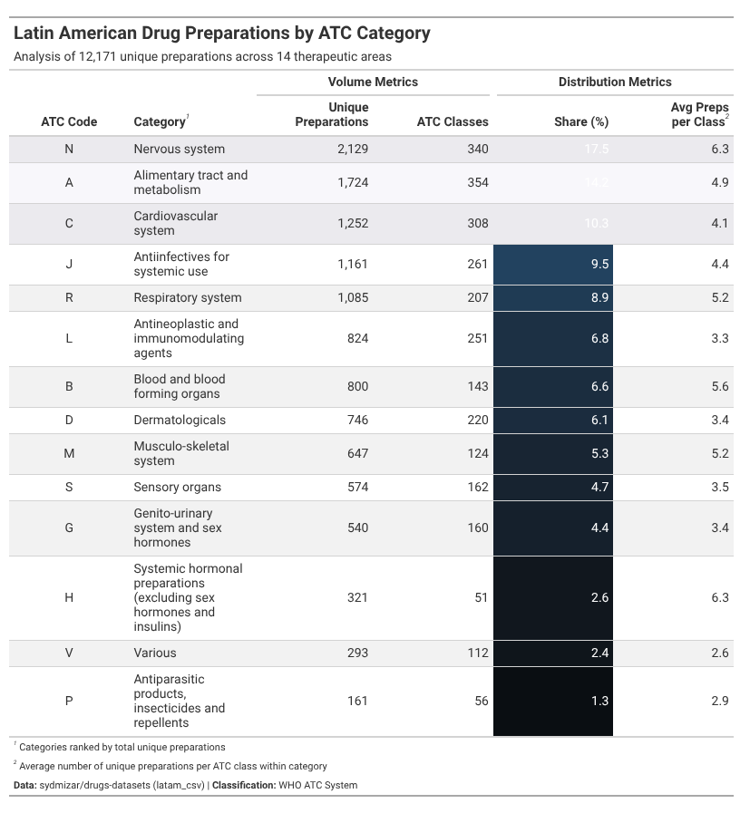
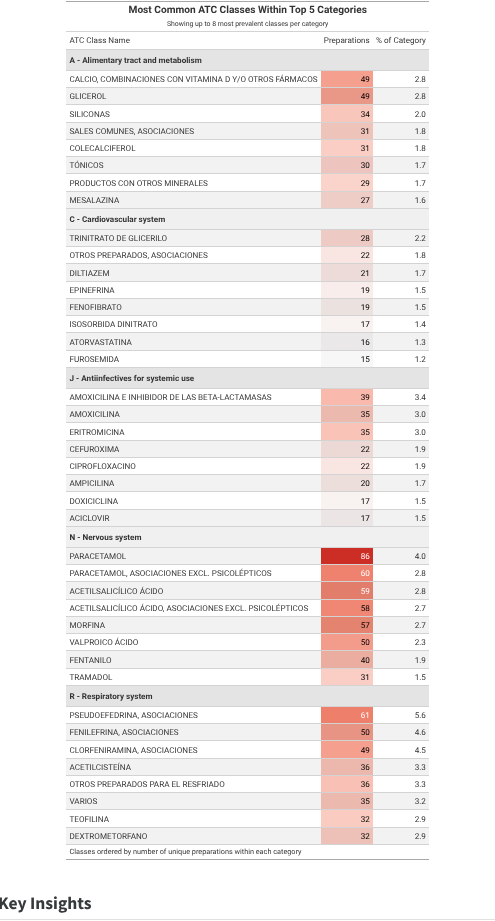
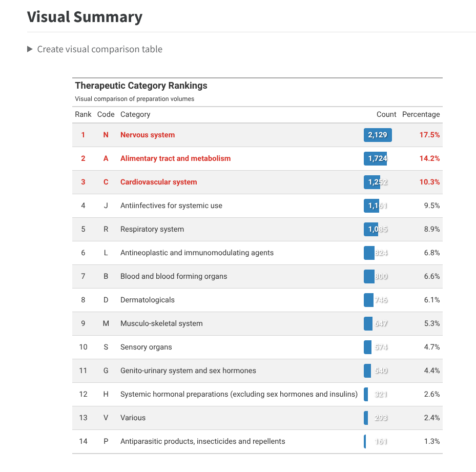

# 💊 Mapping the Latin American Pharmaceutical Landscape

[](https://github.com/posit-dev/gt/discussions)
[](https://opensource.org/licenses/MIT)
[](https://quarto.org)

> An advanced table design analysis of 28,000+ pharmaceutical preparations across Latin America using the WHO ATC classification system

**2025 Table Contest Submission** | 
---

## 📸 Table Previews

### Main Summary Table
*Comprehensive overview with heat-mapped metrics and strategic highlighting*



### Detailed Breakdown  
*Top ATC classes within each major therapeutic category*



### Visual Rankings
*Embedded progress bars with gradient coloring*



---

## 🎯 What This Project Does

This analysis explores pharmaceutical diversity across Latin America by examining **28,533 unique drug preparations** classified under the WHO's Anatomical Therapeutic Chemical (ATC) system. Using advanced `gt` table design techniques, it reveals:

- 🏆 **Market concentration** in 3 therapeutic categories (60%+ of all preparations)
- 🔬 **Formulation diversity patterns** showing competitive vs. specialized areas
- 🌍 **Public health implications** for medication access and equity

### Key Features

- ✅ **Three complementary table designs** (overview, detail, visual)
- ✅ **Advanced `gt` techniques** (HTML transforms, color scales, spanners)
- ✅ **Fully reproducible workflow** (automated data download)
- ✅ **Publication-ready output** (embedded HTML, no dependencies)
- ✅ **Educational documentation** (beginner-friendly code comments)

---

## 🚀 Quick Start

### Prerequisites

- R ≥ 4.2.0
- Quarto ≥ 1.4.0
- Internet connection (first run only)

### Installation & Rendering

```bash
# Clone repository
git clone https://github.com/lukmanaj/latam-pharma-atc-analysis
cd latam-pharma-atc-analysis

# Install required R packages
Rscript -e "install.packages(c('dplyr', 'gt', 'scales', 'glue', 'stringr'))"

# Render analysis
quarto render atc_analysis.qmd

# View output
open output/atc_analysis.html
```

**That's it!** Data downloads automatically on first run and caches locally.

### Alternative: RStudio

1. Open `atc_analysis.qmd` in RStudio
2. Click **"Render"** button
3. Output opens in viewer pane

---

## 📁 Repository Structure

```
latam-pharma-atc-analysis/
├── README.md                      # This file
├── LICENSE                        # MIT License
├── atc_analysis.qmd              # Main Quarto document ⭐
│
├── data/                          # Downloaded automatically
│   ├── commonnamegroup_atc.csv   
│   └── atcclass.csv              
│
├── output/                        # Rendered output
│   └── atc_analysis.html         # Self-contained HTML
│
└── figures/                       # Table screenshots
    ├── main-table.png
    ├── detail-table.png
    └── visual-table.png
```

---

## 🎨 Table Design Highlights

### 1. Multi-Layer Information Architecture

**Overview Table** → **Detailed Breakdown** → **Visual Comparison**

Progressive disclosure allows readers to:
- Scan high-level patterns quickly
- Drill into specific categories of interest
- Compare relative magnitudes visually

### 2. Advanced `gt` Techniques

```r
# Custom HTML progress bars
text_transform(
  locations = cells_body(columns = Preparations),
  fn = function(x) {
    # Generate dynamic progress bar with gradient
    glue("<div style='background: linear-gradient(...'>
           {comma(x)}
         </div>")
  }
)

# Data-driven color scales
data_color(
  columns = `Market Share`,
  method = "numeric",
  palette = c("#f7fbff", "#08519c")
)

# Strategic highlighting
tab_style(
  style = cell_fill(color = "#fff9e6"),
  locations = cells_body(rows = Rank <= 3)
)
```

## 📊 Key Findings

### Finding #1: Market Concentration

**Nervous System** (N), **Cardiovascular System** (C), and **Alimentary Tract** (A) medications account for **60.4%** of all preparations.

This reflects Latin America's epidemiological profile:
- Rising chronic disease burden (diabetes, hypertension)
- Aging populations requiring cardiovascular care
- Mental health treatment expansion

### Finding #2: Formulation Diversity

**Nervous System** shows highest diversity (**8.3 preparations per ATC class**), indicating:
- Competitive pharmaceutical market
- Multiple therapeutic approaches (e.g., various antidepressants)
- Strong commercial interest

### Finding #3: Long-Tail Distribution

Median category represents just **5.1%** of preparations. Smaller categories face:
- Limited treatment options
- Reduced pharmaceutical competition
- Potential access barriers

**Public health implication:** Essential medicine lists should ensure adequate coverage across all categories, not just high-volume areas.

---

## 🛠️ Technical Details

### Data Source

- **Repository:** [sydmizar/drugs-datasets](https://github.com/sydmizar/drugs-datasets)
- **Files:** `commonnamegroup_atc.csv`, `atcclass.csv`
- **License:** Open source (public data)
- **Coverage:** Latin American pharmaceutical preparations

### R Packages Used

| Package | Version | Purpose |
|---------|---------|---------|
| `gt` | ≥0.10.0 | Table creation and styling |
| `dplyr` | ≥1.1.0 | Data manipulation |
| `scales` | ≥1.3.0 | Number formatting |
| `glue` | ≥1.7.0 | String interpolation |
| `stringr` | ≥1.5.0 | String operations |

### Reproducibility

- ✅ All code in `atc_analysis.qmd`
- ✅ No manual data preprocessing
- ✅ Automated data download with caching
- ✅ Session info included in output
- ✅ Embedded HTML (no external dependencies)

**Reproducibility test:** Fresh R session → Run `quarto render` → Identical output

---

## 📚 Learning Resources

### For `gt` Beginners

1. Start with the **Overview Table** (lines 150-250 in `.qmd`)
   - Basic formatting (`fmt_number`)
   - Column alignment
   - Simple color scales

2. Progress to **Detail Table** (lines 300-400)
   - Row grouping
   - Within-group operations
   - Enhanced styling

3. Master **Visual Table** (lines 450-550)
   - Custom HTML transformations
   - Dynamic bar generation
   - Advanced aesthetics

### For Data Analysts

- **Metric calculation patterns** (lines 100-140)
- **Data joining strategies** (lines 80-95)
- **Summary statistics** (lines 115-130)

### For Quarto Users

- Code folding configuration
- Cross-reference system
- Callout blocks for insights
- CSS customization

---

## 🤝 Contributing

This is a contest submission, but improvements are welcome!

**Ideas for extensions:**
- [ ] Add country-level analysis
- [ ] Include temporal trends (if historical data available)
- [ ] Compare with other regions (EU, Asia)
- [ ] Integrate disease burden data
- [ ] Create interactive `reactable` version

**To contribute:**
1. Fork repository
2. Create feature branch (`git checkout -b feature/amazing`)
3. Commit changes (`git commit -m 'Add amazing feature'`)
4. Push to branch (`git push origin feature/amazing`)
5. Open Pull Request

---

## 📖 Citation

If you use this analysis or methodology in your work:

```bibtex
@misc{latam_pharma_atc_2025,
  author = {Lukman Aliyu},
  title = {Mapping the Latin American Pharmaceutical Landscape: 
           An ATC Classification Analysis},
  year = {2025},
  url = {https://github.com/lukmanaj/latam-pharma-atc-analysis},
  note = {2025 Table Contest submission}
}
```

---

## 📧 Contact

**Author:** Lukman Aliyu  
**Email:** lukman.j.aliyu@gmail.com  
**GitHub:** [@lukmanaj](https://github.com/lukmanaj)  

**Questions?** Open an [Issue](https://github.com/lukmanaj/latam-pharma-atc-analysis/issues) or start a [Discussion](https://github.com/lukmanaj/latam-pharma-atc-analysis/discussions)

---

## 🏆 Contest Information

**Event:** [2025 Table Contest](https://github.com/posit-dev/gt/discussions)  
**Organizer:** Posit PBC  
**Deadline:** October 17, 2025  
**Category:** Great Tables / `gt` (R)

---

## 📜 License

**MIT License** — See [LICENSE](LICENSE) file for details

**Data License:** Original data from [sydmizar/drugs-datasets](https://github.com/sydmizar/drugs-datasets) under its respective license

---

## 🙏 Acknowledgments

- **sydmizar** for maintaining the drugs-datasets repository
- **WHO Collaborating Centre** for ATC classification system
- **Posit team** for `gt` package and Quarto
- **2025 Table Contest** community for inspiration

---

<div align="center">

**⭐ If you find this useful, please star the repository! ⭐**

Made with ❤️ using Quarto + R + `gt`

</div>
